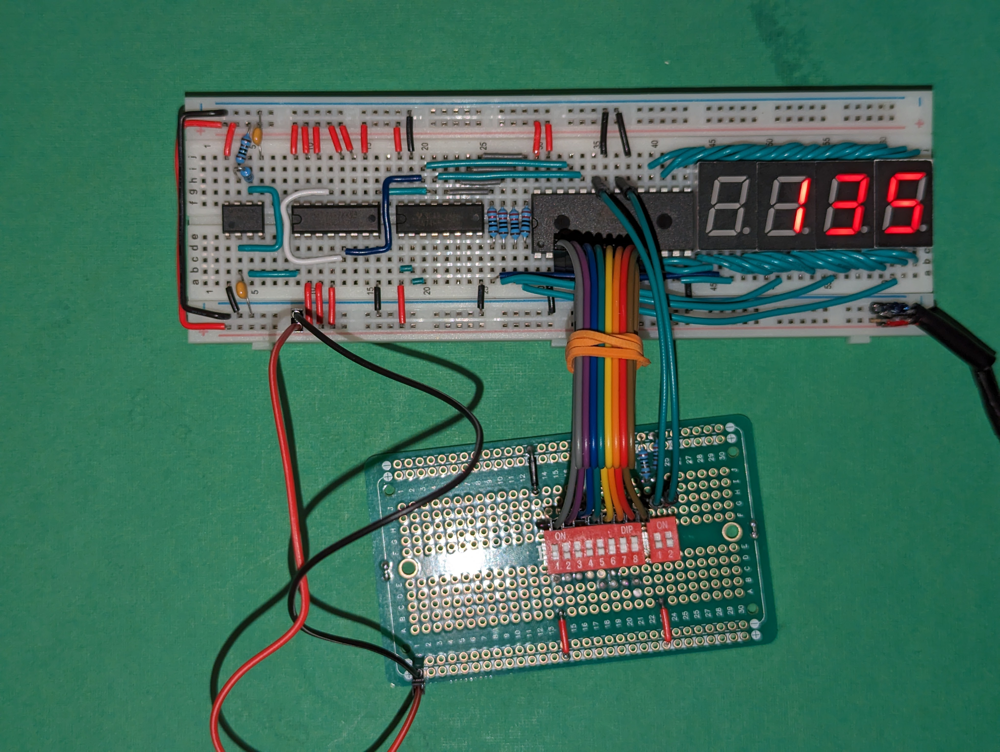
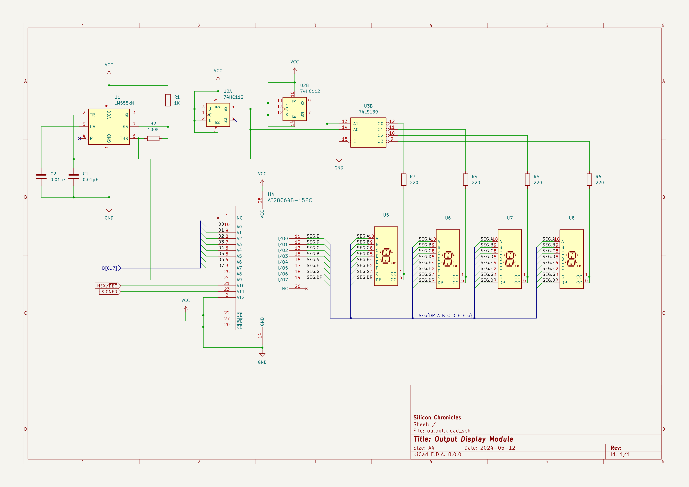

# An 8-bit numeric display

This is a description of a display for showing values of an 8-bit signal. This is useful
for building and debugging breadboard digital circuits working with digital numbers.

It's main features are:

* Can be switched (by a control signal) to display data in both decimal and hex.
* Can interpret data as unsigned numbers (0 to 255), or signed two's complement values (-128 to 127).
  This can also be switched through a control signal.
* has its internal clock, all the input it needs is the input data, power, and mode selection
  lines.

It's inspired in [Ben Eater's output register](https://eater.net/8bit/output), but this
is **just the display** (it does not contain register functionality). I decided to keep
it as a separate unit that I can attach to any register to debug.

## Building the display

### Materials

* R1: 1KΩ
* R2: 100KΩ
* R3-R6: 220Ω (you can choose a slightly different value, this controls the brightness)
* C1, C2: 0.01µF (equivalent to 10nF) ceramic. Usually labeled "103"
* U1: LM555 timer IC
* U2: 74HC112 dual J-K flip-flops. This is different than Eater's design that used a 
  74LS76 (obsolete). Other J-K flip-flop ICs will work OK but may have different pin out.
* U3: 74HC139 dual 2:4 decoder
* U4: AT28C64B EEPROM. You'll have to pre-program it (see below)
* U5-U8: 7-segment display, common cathode. For breadboard use look for some with the
  pins at the top+bottom of the digit, and pins at the right spacing.

All ICs should be in DIP package if you're building in breadboards.

You can also choose TTL compatible components (LS or HCT families for the 74 series, and
NE555 for the timer IC). As long as you're consistent, it's the same; all external
inputs come into the EEPROM, which accepts both TTL and CMOS inputs.

### Data sheets

* [LM555](https://www.ti.com/lit/ds/symlink/lmc555.pdf)
* [74HC112](https://www.ti.com/lit/ds/symlink/sn74hc112.pdf)
* [74HC139](https://www.ti.com/lit/ds/symlink/sn74hc139.pdf)
* [AT28C64B](https://ww1.microchip.com/downloads/en/devicedoc/doc0001h.pdf)

## Preparing the ROM

I'm also providing a [pre-built ROM file](output.bin) if you want to use mine unchanged